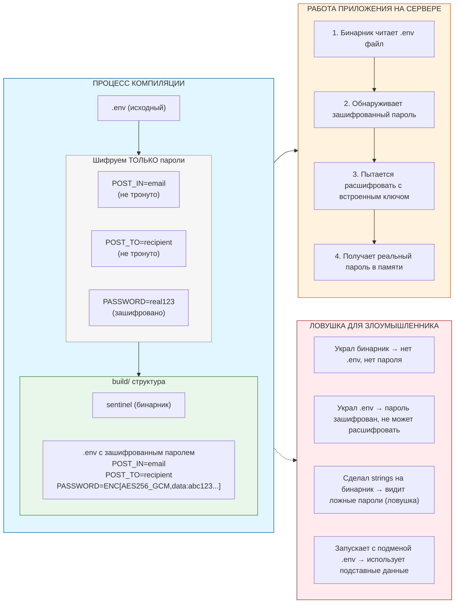

# GoSentinel

### Todo
- [ ] сделать описание 
  - [ ] Ru
  - [ ] Eng
- [x] модуль email
- [x] модуль collector
  - [x] cpu
  - [x] memory
  - [x] disk
  - [x] process
  - [x] net
- [x] модуль report
  - [x] formatter
  - [ ] Плановый отчет (Daily): 1 раз в сутки (например, в 9:00 утра)
  - [ ] Триггерный отчет (Alerts): Самое важное. Программа должна собирать данные каждые 5-10 минут, но отправлять письмо ТОЛЬКО ЕСЛИ:
    - [ ] RAM Used > 90%
    - [ ] Disk Used > 90%
    - [ ] Inodes Used > 90%
    - [ ] Появился новый процесс в netInfo, которого нет в «белом списке».
- [ ] наладить работу с .env
- [x] сделать Make файл
- [ ] версия для prometheus?
  - [ ] тогда надо делать вэб-сервис с постоянной трансяцией данных на http://ip:9100/metrics

## Вывод/Письмо
```txt
CPU Info:	Model=QEMU Virtual CPU version 2.5+, Vendor=AuthenticAMD, Cores=1, Usage=16.35%.
Disk:		Total=29GB, Used=10GB (37.9%) Free=17GB (62.1%), Inodes=7.5%.
Host:		vps-7960 [ubuntu 24.04], Uptime=663h35m24s, Processes=111, Running=3, Blocked=0, Created=905815, VM=kvm (guest)
Memory:		Total=961MB, Available=532MB, Used=429MB (44.67%), Free=149MB
Swap:		Total=1916MB, Used=222MB (11.59%), Free=1694MB
User:		root, Host=45.9.212.11, Started=17:27:25, Terminal=pts/0.
User:		root, Host=45.9.212.11, Started=17:27:31, Terminal=pts/1.
Process: mongod               Port: 27017 PID: 736196
Process: systemd-resolved     Port: 53    PID: 594045
Process: hysteria             Port: 25413 PID: 693
Process: systemd-resolved     Port: 53    PID: 594045
Process: systemd              Port: 22    PID: 1
Process: python               Port: 28260 PID: 502765
Process: user_auth            Port: 28262 PID: 688
Process: xray                 Port: 444   PID: 717
Process: caddy                Port: 443   PID: 689
Process: systemd              Port: 22    PID: 1

Письмо успешно отправлено!
```

## Схема работы с .env


```bash
make encrypt
#echo $ENCRYPTION_KEY 
```

```bash
make run-remote-amd64
```
```bash
make run-local-arm64
```
```bash
make run-mac
```
