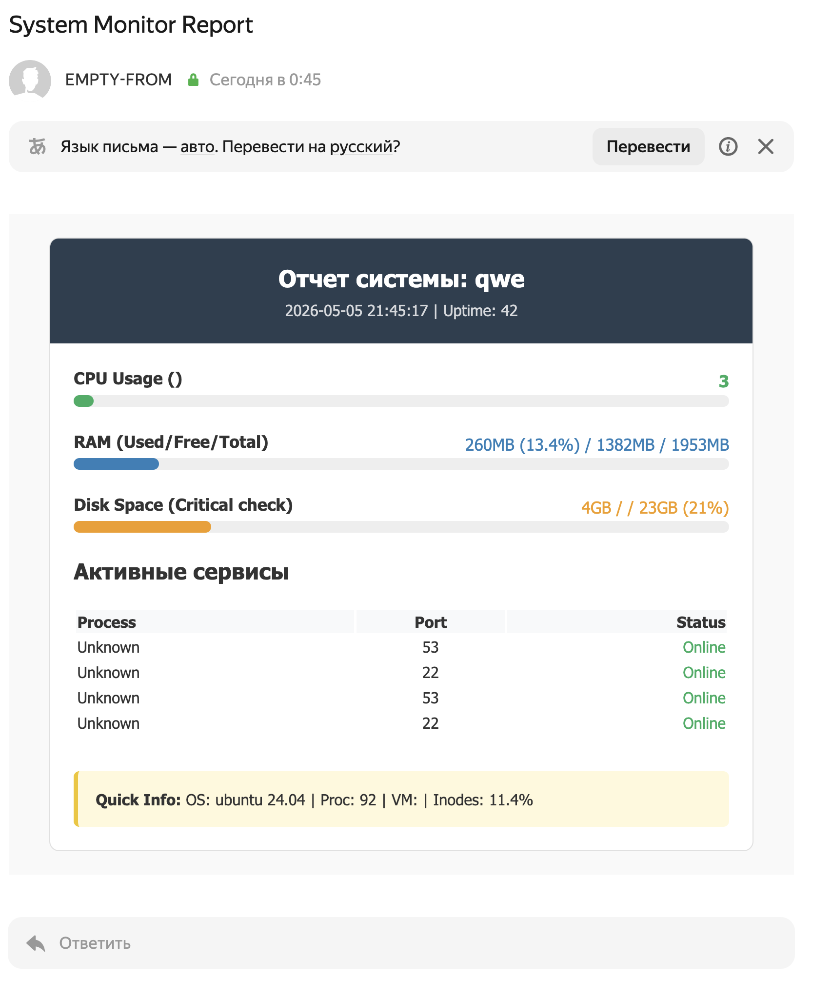

# Sentinel

**Sentinel** — это лёгкий CLI-сервис на Go для сбора системных метрик и отправки отчёта (в консоль или по email).

Проект написан как pet-project для изучения:

* работы с системными метриками
* конфигурации через `.env`
* базовой архитектуры приложения на Go

---

## Возможности

* Сбор метрик системы:

    * CPU
    * память (RAM + swap)
    * диск
    * хост (uptime, процессы)
    * пользователи
    * сетевые соединения (LISTEN)
* Формирование отчёта
* Вывод:

    * в консоль
    * email (текст / HTML)
    * debug-режим с HTTP-просмотром

---

## Режимы работы

Задаются через переменную `MODE`:

| Mode         | Описание                                      |
|--------------|-----------------------------------------------|
| `console`    | вывод в консоль                               |
| `email-text` | отправка текстового письма                    |
| `email-html` | отправка HTML-письма                          |
| `test`       | запуск локального HTTP-сервера с HTML отчётом |

---

## Конфигурация

Sentinel автоматически ищет `.env` файл:

Приоритет:

1. `build/.env.encrypted`
2. `.env.encrypted`
3. `.env`
4. `/etc/sentinel/.env`
5. `~/config/sentinel/.env`

---

### Пример `.env`

```env
POST_IN=test@yandex.ru
POST_TO=admin@yandex.ru
PASSWORD=your_password

SMTP_HOST=smtp.yandex.ru
SMTP_PORT=587

MODE=console

# MODE=email-text
# MODE=email-html
# MODE=test
```

---

## Шифрование пароля

Для production можно использовать зашифрованный `.env`:

```bash
make encrypt
```

Создаётся:

* `build/.env.encrypted`
* `build/.env.key`

Перед запуском нужно задать:

```bash
export ENCRYPTION_KEY=your_key
```

---

## Запуск

### Локально(для мак)

```bash
make run-local
```

### Удалённо

```bash
make run GOOS=linux GOARCH=amd64 HOST=remote
```

Makefile:

* собирает бинарь под нужную платформу
* деплоит на сервер
* прокидывает `ENCRYPTION_KEY` (если есть)

## Шифрование

```bash
make encrypt
```

Создаёт:

* `.env.encrypted`
* `.env.key`

Ключ используется через переменную окружения `ENCRYPTION_KEY`.

## Архитектура

Проект разделён на слои:

```
cmd/
  sentinel/         entrypoint

internal/
  config/           загрузка конфигурации
  collector/        сбор системных метрик
  report/           агрегирование данных
  message/          отправка (email / html)
```

Основная логика находится в `app` слое (orchestration).

---

## Примеры вывода
### В консоль или писмо в текстовом варианте

```text
CPU Info: Model=..., Usage=16.35%
Disk: Total=29GB, Used=10GB (37.9%)
Host: uptime=663h...
Memory: Used=429MB (44.67%)

Process: mongod Port: 27017 PID: ...
```

### Письмо в формате HTML



---

## TODO

* [ ] Тестирование
* [ ] Периодический запуск (cron / ticker)
* [ ] Алерты (RAM / Disk / Inodes)
* [ ] Daily отчёт
* [ ] Белый список процессов
* [ ] HTTP endpoint / Prometheus exporter
* [ ] Английская версия README

---

## Цель проекта

Не production-ready сервис, учебный проект с упором на:
* архитектуру
* читаемость кода
* работу с конфигурацией

---

## Стек

* Go (stdlib)
* gopsutil
* SMTP (`net/smtp`)
* `.env` конфигурация
* Makefile
